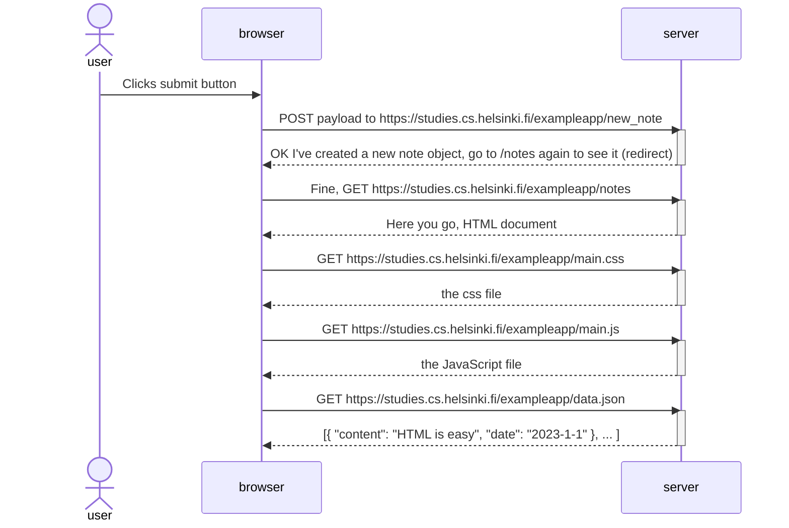

```mermaid
sequenceDiagram

%%This diagram describes the Post-Redirect-Get communication pattern between browser and server when submitting form data

    actor user
    participant browser
    participant server

    user->>browser: Clicks submit button
    %% form data sent as the body of POST request
    browser->>server: POST payload to https://studies.cs.helsinki.fi/exampleapp/new_note
    activate server
    %% The server creates a new note object, and adds it to an array called notes.
    server-->>browser: OK I've created a new note object, go to /notes again to see it (redirect)
    deactivate server

    browser->>server: Fine, GET https://studies.cs.helsinki.fi/exampleapp/notes
    activate server
    server-->>browser: Here you go, HTML document
    deactivate server

    browser->>server: GET https://studies.cs.helsinki.fi/exampleapp/main.css
    activate server
    server-->>browser: the css file
    deactivate server

    browser->>server: GET https://studies.cs.helsinki.fi/exampleapp/main.js
    activate server
    server-->>browser: the JavaScript file
    deactivate server

    browser->>server: GET https://studies.cs.helsinki.fi/exampleapp/data.json
    activate server
    server-->>browser: [{ "content": "HTML is easy", "date": "2023-1-1" }, ... ]
    deactivate server
```
