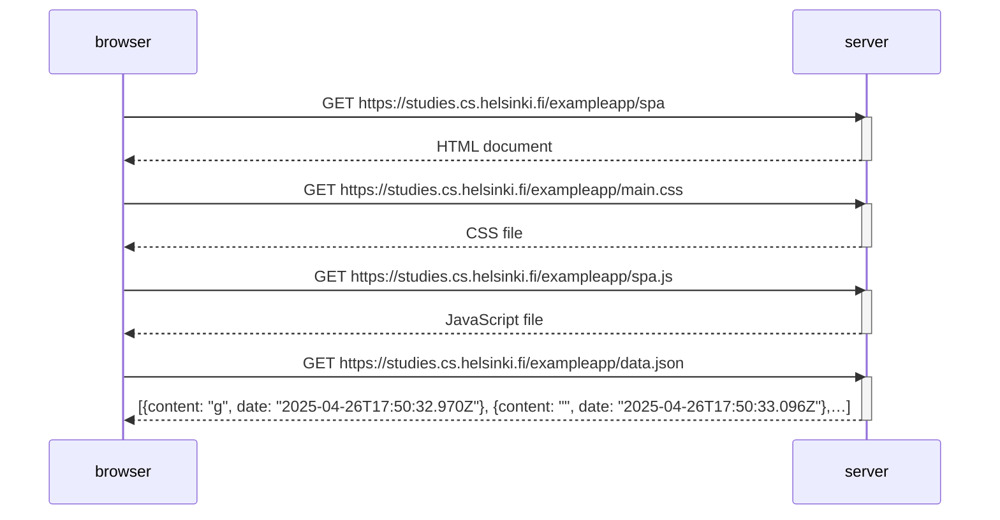

```mermaid
sequenceDiagram

%% This diagram describes the communication between browser and server when opening the page https://studies.cs.helsinki.fi/exampleapp/spa
%% The process is essentially the same as opening https://studies.cs.helsinki.fi/exampleapp/notes

    participant browser
    participant server

    browser->>server: GET https://studies.cs.helsinki.fi/exampleapp/spa
    activate server
    server-->>browser: HTML document
    deactivate server

    browser->>server: GET https://studies.cs.helsinki.fi/exampleapp/main.css
    activate server
    server-->>browser: CSS file
    deactivate server

    browser->>server: GET https://studies.cs.helsinki.fi/exampleapp/spa.js
    activate server
    server-->>browser: JavaScript file
    deactivate server

    browser->>server: GET https://studies.cs.helsinki.fi/exampleapp/data.json
    activate server
    server-->>browser: [{content: "g", date: "2025-04-26T17:50:32.970Z"}, {content: "", date: "2025-04-26T17:50:33.096Z"},…]
    deactivate server
```
