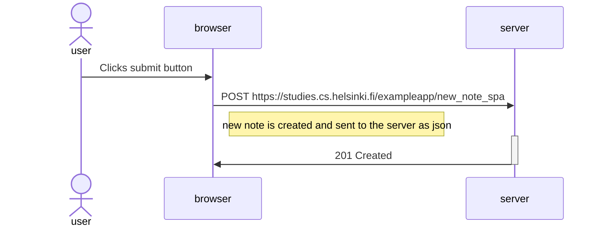

```mermaid
sequenceDiagram

    actor user
    participant browser
    participant server

    %% the content-type sent to /new_note is x-www-form-urlencoded, while the content-tye sent to /new_note_spa is json

    user->>browser: Clicks submit button
    browser->>server: POST https://studies.cs.helsinki.fi/exampleapp/new_note_spa
    note right of browser: new note is created and sent to the server as json

    activate server
    server->>browser: 201 Created
    deactivate server
```
